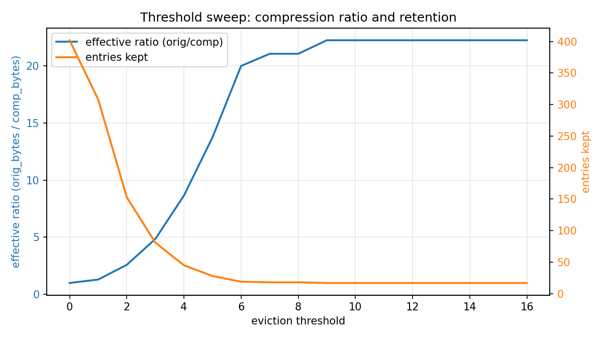
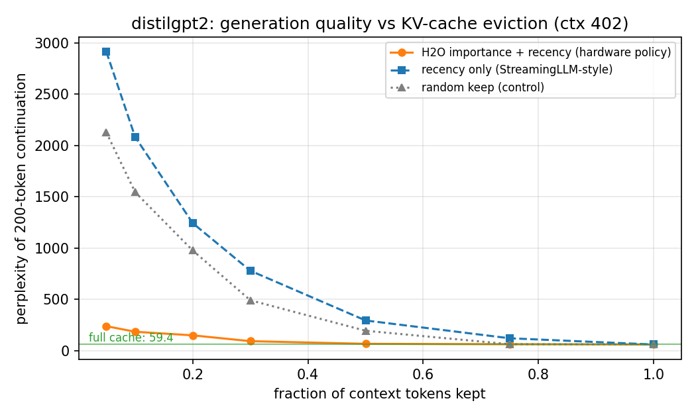
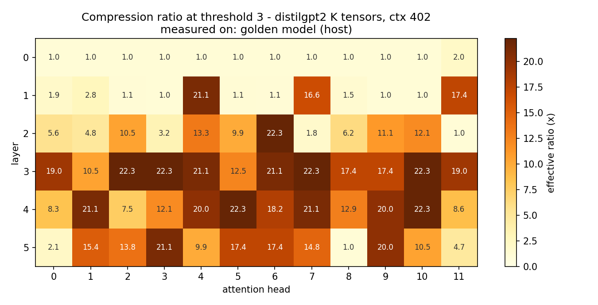

# KV-Cache Optimization Accelerator (Artix-7 FPGA)

A **Verilog RTL** memory-side accelerator prototype that compresses and prunes
transformer **KV-cache** data in hardware, and restores it on demand — validated
**bit-exact** on **real distilgpt2 KV-cache slices** against a Python golden model.


-1b7a4a)


---

## Overview

Modern transformer inference is bottlenecked by the **key–value (KV) cache**, whose
footprint grows linearly with context length. This project implements a **memory-side
accelerator** that reduces that footprint directly in fabric: it scores tokens by
attention importance, **evicts** the unimportant ones, **compresses** the survivors
(delta + run-length coding with a raw-bypass safeguard), and — closing the loop — a
**hardware decompressor** reconstructs the original vectors on request.

The full path is exercised end-to-end from a PC host and checked **byte-for-byte** against
a Python reference implementation, on **real quantized distilgpt2 KV-cache tensors**.

## Highlights

- Implemented a **Verilog RTL** KV-cache optimization prototype on an **Artix-7 FPGA**,
  performing **importance-based (attention-driven) eviction**, delta/RLE compression,
  bypass handling, and **hardware decompression** for quantized distilgpt2 KV-cache slices.
- Built an end-to-end **PC-to-FPGA validation flow** with a framed serial transport,
  **Python golden-model** checking, and **Vivado self-checking testbenches**; achieved
  **bit-exact hardware validation** on real KV-cache data (both compress and restore paths).
- Evaluated **memory–quality tradeoffs** via threshold sweeps and a **perplexity ablation**,
  showing up to **22.3× effective memory reduction** on selected KV slices and only
  **+11% perplexity at 50% cache retention** under an H2O-style importance policy.
- Met **100 MHz timing** on Artix-7 with low logic utilization, and reported **resource,
  throughput, and power figures** from Vivado implementation reports.

## Architecture

Store-and-forward datapath (load → process → drain), single 100 MHz clock domain,
**18 Verilog RTL modules**, no vendor IP (all memories inferred):

```
 Host (Python)                     FPGA fabric (Verilog RTL)
 ─────────────                     ─────────────────────────
 score tokens by                   ┌─ evict  (importance ≥ threshold)
 attention importance    ───▶      ├─ delta encode
 quantize to INT8                  ├─ zero-run RLE
 frame + checksum                  ├─ bypass  (send raw if incompressible)
                                   └─ store + stats (compression ratio, cycles)
 verify every byte       ◀───      hardware decompressor:  RLE⁻¹ → delta⁻¹  (restore on demand)
 against golden model
```

The forward pipeline (`evict → delta_enc → rle_enc → bypass`) and its **inverse**
(`rle_dec → delta_dec`) are both in RTL, so the board is a complete round-trip
memory node: store compressed, restore losslessly.

## Results

All figures and numbers below are **measured on hardware** (or on the bit-exact-equivalent
golden model where noted).

### Memory reduction vs. eviction threshold

Effective compression is dominated by importance-based eviction; a single threshold dial
trades cache size against retention. Up to **22.3×** effective reduction on the profiled
slice; **4.84×** while retaining 81 of 402 tokens.



### Accuracy: perplexity ablation

The importance policy degrades gracefully — **+11% perplexity at 50% retention** — while
recency-only and random-keep baselines collapse, confirming that the *scoring* earns the
savings, not eviction alone.



### Layer / head analysis

Sweeping every attention head shows evictability is highly structured: some layers are
near-incompressible, others uniformly compressible — a per-head map of where KV-cache
optimization pays off.



### Implementation report card (Vivado, XC7A35T)

| Dimension        | Result |
|------------------|--------|
| **Utilization**  | 2,148 LUT (10.3%) · 2,174 FF (5.2%) · 24.5 BRAM (49%) · 2 DSP |
| **Timing (Fmax)**| meets **100 MHz**, WNS **+0.98 ns** (positive slack) |
| **Throughput**   | 95.5 MB/s engine · 0.27 ms per slice |
| **Power**        | 156 mW on-chip (83 mW dynamic) · **1.63 nJ/byte** · 0.61 GB/s/W |
| **Correctness**  | **bit-exact** compress *and* restore · simulation = silicon (cycle-exact) · 8/8 self-checking testbenches pass |

Full reports: [`docs/reports/`](docs/reports/) · figures of merit: [`docs/reports/fom.txt`](docs/reports/fom.txt) · write-up: [`docs/results.md`](docs/results.md).

## Verification methodology

Correctness is defined **once**, in a Python **golden model** ([`host/golden.py`](host/golden.py)),
and every layer is checked against it mechanically:

- the golden model generates all simulation stimulus/expected vectors;
- **8 self-checking Verilog testbenches** compare RTL output byte-for-byte (`python scripts/run_sims.py`);
- the same golden model verifies bytes returned from the **physical board** over the host link;
- simulation and silicon are cross-checked to the **exact cycle count**.

No stage is judged by inspection — every gate is a byte (or cycle) comparison.

## Repository layout

```
rtl/          18 Verilog-2001 modules (datapath, compressor, decompressor, protocol FSM, I/O)
sim/          8 self-checking testbenches + generated vectors
host/         Python: golden model, host CLI, distilgpt2 KV exporter, ablations, plots
constraints/  pin + timing constraints
scripts/      simulation runner, build + power-summary scripts
docs/         specs (encoding / protocol / interfaces), results.md, Vivado reports, figures
```

## Reproduce

```bash
# 1. simulation (no hardware needed) — regenerate vectors, run all testbenches
python host/make_vectors.py
python scripts/run_sims.py            # -> 8/8 PASS

# 2. golden-model dry run on real distilgpt2 KV data
python host/export_kv.py --layer 2 --head 5 --kv k --out host/slice.npz
python host/golden_sweep.py host/slice.npz

# 3. accuracy + analysis
python host/ppl_ablation.py           # perplexity vs. retention
python host/evict_map.py              # per-layer/head evictability map

# 4. on hardware: program the bitstream, then
python host/kv_host.py check   --port <PORT> --npz host/slice.npz --threshold 3   # bit-exact compress
python host/kv_host.py restore --port <PORT> --npz host/slice.npz --threshold 3   # bit-exact fabric restore
```

Build the design from source with Vivado (`scripts/build_bitstream.tcl`) targeting
`xc7a35tcpg236-1`. The prototype was brought up on a Digilent Artix-7 development board
with a framed serial (UART) host link; the RTL and host flow are board-agnostic.

## Scope

A personal engineering project exploring FPGA-based, memory-side KV-cache optimization.
The techniques (attention/heavy-hitter eviction, low-overhead residual compression) are
drawn from recent KV-cache literature and reimplemented and hardware-validated in RTL at
prototype scale, with an emphasis on a rigorous, bit-exact verification flow.

## License

[MIT](LICENSE)
