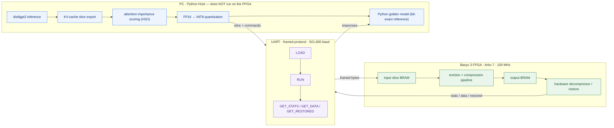
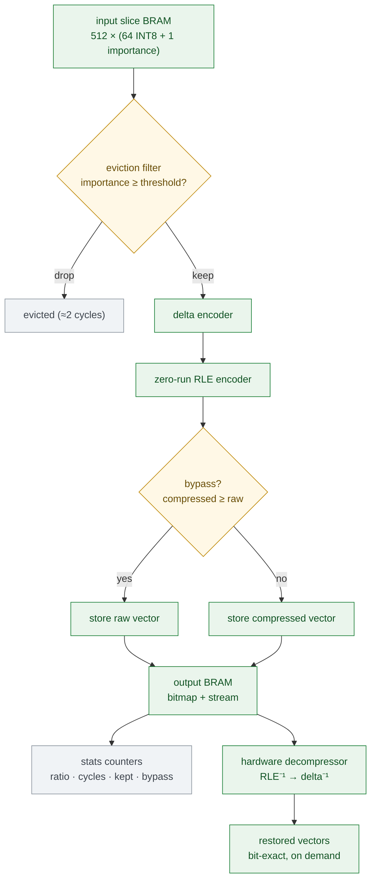
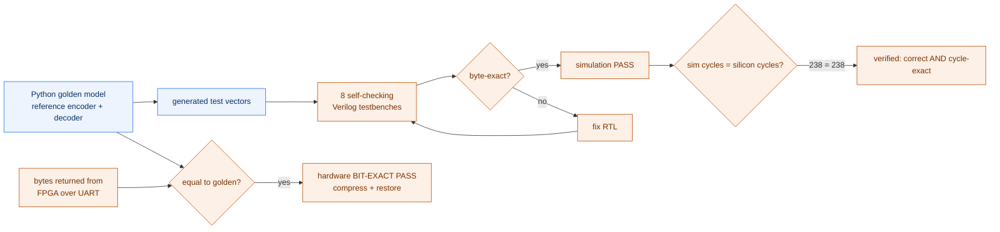
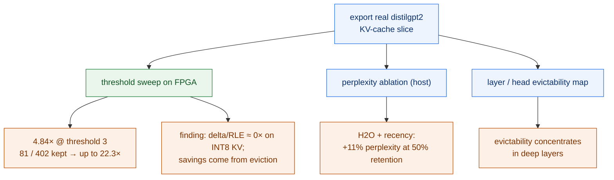

# Architecture & Flow Diagrams

Scope: a **toy / prototype memory-side FPGA pipeline**. The FPGA does **not** run the LLM —
the PC runs distilgpt2 and exports quantized KV-cache slices; the FPGA prunes, compresses,
and restores them. The hero diagram is [`architecture.svg`](architecture.svg); the Mermaid
sources below render natively on GitHub and paste into slides via
[mermaid.live](https://mermaid.live).

Colour key: **blue** = PC / software · **purple** = UART / protocol ·
**green** = FPGA hardware · **orange** = metrics / results.

---

## 1. System architecture

---

## 2. FPGA internal pipeline

Store-and-forward, single 100 MHz clock domain, Verilog RTL, all memories inferred.
Each entry is **64 INT8 value bytes + 1 importance byte**; up to **512 entries** per slice.

---

## 3. Verification flow

Correctness is defined once in the Python golden model; simulation and silicon are both
checked against it, byte-for-byte.

---

## 4. Evaluation / results flow

